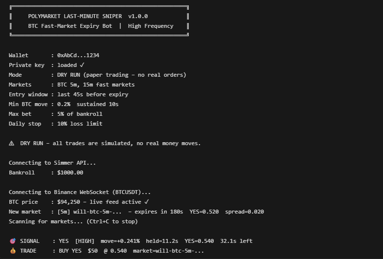

# Polymarket Last-Minute Sniper

**High-Frequency Endgame Bot** — exploits BTC fast-market mispricing on Polymarket during the final 60 seconds before expiry.

## Live Output Sample



When the bot runs you will see:
- Wallet address and key status confirmed on startup
- Live BTC price feed from Binance confirmed
- Each new market detected with YES price, spread, and seconds remaining
- `🎯 SIGNAL` lines when entry conditions are met (side, strength, move %, hold time)
- `💰 TRADE` lines when an order is placed (side, size, entry price, market slug)

---

## Strategy Overview

| Phase | Action |
|-------|--------|
| Detect | Find active BTC 5m/15m Polymarket markets via Gamma API |
| Track | Capture market-open BTC price; live-stream Binance BTCUSDT trades |
| Wait | Do nothing until last **45 seconds** before expiry |
| Signal | Trigger if BTC has moved ≥ 0.20% from open AND been sustained for ≥ 10 seconds |
| Execute | Place limit order; cancel if stale after 2 seconds; aggressive fill for HIGH confidence |
| Exit | Force-close 5 seconds before expiry OR settle naturally at expiry |

### BUY YES conditions
- BTC current ≥ open + 0.20%
- YES price < 0.72 (mispriced)
- Move sustained ≥ 10 seconds

### BUY NO conditions
- BTC current ≤ open − 0.20%
- YES price > 0.30 (mispriced)
- Move sustained ≥ 10 seconds

### Filters
- Spread ≤ 3 cents
- Minimum liquidity $50
- No duplicate positions per market

---

## Project Structure

```
polymarket-last-minute-sniper/
├── src/
│   ├── index.ts              # Main entry point & event loop
│   ├── types/
│   │   └── index.ts          # All TypeScript interfaces
│   ├── config/
│   │   └── index.ts          # .env loading & config defaults
│   ├── clients/
│   │   ├── gamma.ts          # Gamma API – market discovery
│   │   ├── simmer.ts         # Simmer API – order execution
│   │   └── binance.ts        # Binance WebSocket – live BTC price
│   ├── strategies/
│   │   └── sniper.ts         # Core signal evaluation & execution logic
│   ├── risk/
│   │   └── manager.ts        # Position sizing, daily stop, bankroll
│   ├── analytics/
│   │   └── dashboard.ts      # Win rate, ROI, P&L by minute bucket
│   └── utils/
│       └── logger.ts         # Pino structured logger
└── tests/
    ├── risk.test.ts           # Risk manager unit tests
    ├── sniper.test.ts         # Signal evaluation unit tests
    └── analytics.test.ts     # Dashboard unit tests
```

---

## Requirements

- **Node.js** ≥ 18
- **npm** ≥ 9
- A **Simmer Markets** account with API key ([simmer.markets](https://simmer.markets))

---

## Installation

```bash
# 1. Enter the project directory
cd polymarket-last-minute-sniper

# 2. Install dependencies
npm install

# 3. Copy and configure environment
cp .env.example .env
# Edit .env and set SIMMER_API_KEY

# 4. Build TypeScript
npm run build
```

---

## Running

### Production (compiled)
```bash
npm run build
npm start
```

### Development (hot-reload)
```bash
npm run dev:watch
```

### Dry-run (paper trading, no real orders)
```bash
DRY_RUN=true npm run dev
```

---

## Configuration

All settings are controlled via environment variables in `.env`.  
See `.env.example` for the full list with descriptions.

Key variables:

| Variable | Default | Description |
|----------|---------|-------------|
| `SIMMER_API_KEY` | **required** | Your Simmer Markets API key |
| `DRY_RUN` | `false` | Simulate trades without execution |
| `ENTRY_WINDOW_SECS` | `45` | Enter only in last N seconds |
| `SUSTAINED_MOVE_SECS` | `10` | BTC move must hold for N seconds |
| `MIN_MOVE_PCT` | `0.20` | Min BTC % move from open to trigger |
| `MAX_OPEN_POSITIONS` | `1` | Maximum simultaneous positions |
| `DAILY_STOP_LOSS_PCT` | `0.10` | Stop trading after 10% daily drawdown |
| `BASE_BET_PCT` | `0.02` | Base position size (2% of bankroll) |
| `MAX_BET_PCT` | `0.05` | Max position size (5% of bankroll) |
| `MARKET_WINDOWS` | `5m,15m` | Market timeframes to monitor |
| `LOG_LEVEL` | `info` | Pino log level |

---

## Testing

```bash
# Run all tests
npm test

# With coverage report
npm run test:coverage

# Watch mode
npm run test:watch
```

Test coverage:
- **Risk Manager**: position sizing, daily stop, open/close/expire lifecycle, signal classification
- **Sniper Strategy**: signal evaluation (all rejection paths + valid YES/NO signals), price tracking
- **Analytics Dashboard**: win rate, P&L, minute bucket grouping, signal strength breakdown, persistence

---

## Analytics Dashboard

The dashboard prints every 60 seconds and on shutdown:

```
────────────────────────────────────────────────────────────
  📊  POLYMARKET LAST-MINUTE SNIPER  –  ANALYTICS
────────────────────────────────────────────────────────────
  As of          : 2026-04-29T16:30:00.000Z
  Bankroll       : $1,048.23
  Daily P&L      : $12.4500
  Total P&L      : $48.2300
  ROI            : 4.82%
  Total Trades   : 27
  Win Rate       : 63.0%  (17W / 10L)
  Avg Hold Time  : 18.4s

  P&L by Minute Bucket:
    min  0  ████       40% WR   5 trades  pnl $-2.1200
    min  3  ████████   80% WR   5 trades  pnl $18.4400
    min  4  ██████     60% WR  17 trades  pnl $31.9100

  Signal Strength Breakdown:
    HIGH      12 trades  75% WR  pnl $38.2100
    MODERATE   9 trades  56% WR  pnl $12.0400
    WEAK       6 trades  33% WR  pnl $-2.0200
────────────────────────────────────────────────────────────
```

Trade history is persisted to `sniper-trades.jsonl` (configurable via `ANALYTICS_FILE`).

---

## Risk Model

| Mechanism | Detail |
|-----------|--------|
| Max positions | 1 simultaneous (configurable) |
| Daily stop loss | 10% of bankroll (configurable) |
| Dynamic sizing | WEAK: 30% of base, MODERATE: 60%, HIGH: 100% max |
| Stale order cancel | Auto-cancel limit orders after 2 seconds |
| Pre-expiry exit | Force-close 5 seconds before expiry if position open |

---

## Architecture Notes

- **Binance WebSocket** auto-reconnects on disconnect with 3-second backoff
- **Market discovery** polls Gamma API every 10 seconds; expired markets are pruned
- **Signal evaluation** runs every 2 seconds during the entry window
- **Simmer API** is used for all order execution (handles Polymarket CLOB internally)
- All trades are logged to JSONL for post-session analysis

---

## Disclaimer

This software is for educational purposes only. Prediction market trading carries significant financial risk. Past performance does not guarantee future results. Use at your own risk.
